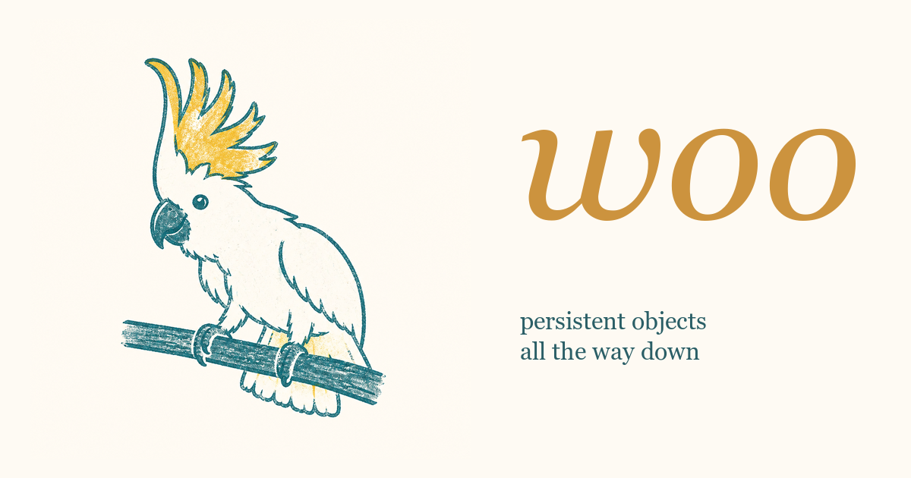

Woo
===

World of Objects.

Woo is a programmable, shared, persistent object world for social spaces.
Built for humans and agents. Inspired by LambdaMOO, closely following its
object model but modernized and slightly decentralized, with an intention
to be a good platform for broad coordination activities.



## Current Status

Early implementation. Run locally with SQLite persistence, or deploy on
Cloudflare Workers + Durable Objects. Objects in the world deploy across
multiple DOs.

Online demo: https://woo.hughpyle.workers.dev/

Objects, properties and verbs, permissions, a VM runtime.  Some support
for installing and sharing "catalogs", Git-hosted collections of objects that
make up an application.  Websocket and REST APIs.

Current example apps installed from the local build include: a small chat-room
with many of the LambdaMOO chat behaviors (and a cockatoo); "Dubspace", a
realtime interactive audio playground; "Taskspace", a task-management workspace
(e.g. for AI agents), and a very minimal IDE/inspector.  The demo UI is just
a placeholder.  There's no immediate plan to have objects declare their own UI.

## Specification

Start with [spec/README.md](spec/README.md).

## Implementation Plan

Runtime code lives under [src/](src/), with focused tests under [tests/](tests/).
Historical milestone notes are in [notes/](notes/).

Near-term goals: functional IDE for programmers; user onboarding flows;
fork/suspend VM operations; more detail in [spec/profiles.md](spec/profiles.md).

## Run Locally

```sh
npm install
cp .dev.vars.example .dev.vars   # safe defaults for local dev
npm test
npm run dev
```

Then open <http://localhost:5173>.

## Deploy your own world

woo is fork-and-deploy — either locally, or see [DEPLOY.md](DEPLOY.md) for
deploying a world to your own Cloudflare account.

## Working Rule

Keep runtime changes aligned with the spec. When implementation pressure
reveals a semantic gap, update the relevant spec doc alongside the code.
