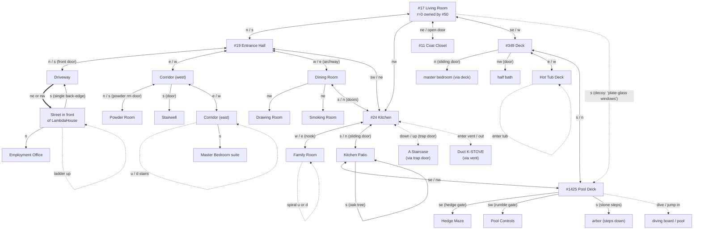

# LambdaMOO map: Living Room and ~2-3 steps out

Walked on 2026-05-02 from `tty (#112104)`. Source: live exits and `look`
descriptions, supplemented by the in-room "map of LambdaHouse" item which
LambdaMOO ships in the Living Room. Object IDs captured where I could read
`.exits` (Living Room only; downstream rooms have read-protected exits).

## Mermaid



> - `<-->` = bidirectional, both directions verified.
> - `-->`  = forward verified; back not verified or known-asymmetric.
> - `==>`  = multi-edge forward (DRV → STREET has *two* forward exits, one back).
> - `-.->` = verb-mediated / non-cardinal exit.
> - The LR → POOL `s` edge exists in `.exits` but is a **decoy**: invokes
>   a witticism (`"don't really want to walk through plate-glass windows"`)
>   instead of moving you. Real Pool Deck access is `LR se → DECK s → POOL`.

## Living Room (#17)

Owner #50. Flags `r=0 w=0 f=0 player=0` — the room itself is *not* publicly
readable. `.exits` was readable for Living Room (so we got the exit IDs)
but every neighboring room had `.exits` permission-denied. I scraped the
rest from `look` descriptions while walking.

Five obvious exits:

| Exit obj | Names               | Dest                      |
| -------- | ------------------- | ------------------------- |
| `#22`    | n, north            | #19 The Entrance Hall     |
| `#25`    | nw, northwest       | #24 The Kitchen           |
| `#18`    | ne, northeast, closet | #11 The Coat Closet     |
| `#350`   | se, sliding door, door, southeast | #349 The Deck |
| `#425`   | s, south            | #1425 The Pool Deck       |

Visible items: Welcome Poster, fireplace, the living room couch (#92234),
Statue (#26270), a map of LambdaHouse, Fun Activities Board, The Birthday
Machine (#5607), Helpful Person Finder, lag meter, Cockatoo. Sleepers:
various (each marked "out on his feet" or "dozing").

The map item contains an ASCII diagram of LambdaHouse and surroundings —
worth reading via `read map` whenever orienting in a new core. It explicitly
warns: *"Some exits are one-way, and some, such as `enter`, `up`, and
`down`, aren't shown."* That advisory is the headline finding: in LambdaMOO,
the structured `room.exits` list is only the *cardinal* surface; the rest
of the navigation graph is verb-mediated and only discoverable by trying.

## Edge directionality

Verified by walking each direction, plus explicit probes for asymmetric
cases. "Forward" = away from Living Room.

| Edge | Forward | Back | Symmetric? |
| --- | --- | --- | --- |
| LR ↔ EH | `n` | `s` | ✓ |
| LR ↔ KIT | `nw` | **none direct** — must route via EH (KIT `ne` → EH, `s` → LR) | **✗ asymmetric** |
| LR ↔ COAT | `ne` (or `closet`) | `open door` / `turn knob` (no cardinal direction!) | ✓ but verb-mediated back |
| LR ↔ DECK | `se` (or `sliding door`) | `w` | ✓ |
| LR → POOL | `s` exists in `.exits` but **prints a witticism and doesn't move you** | n/a | **decoy / one-way no-op** |
| EH ↔ DRV | `n` (front door) | `s` (front door) | ✓ |
| EH ↔ COR1 | `e` | `w` | ✓ |
| EH ↔ DIN | `w` (archway) | `e` | ✓ |
| EH ↔ KIT | `sw` | `ne` | ✓ |
| DRV ↔ STREET | `ne` **and** `nw` (two distinct forward exits, both land in the same Street) | `s` only | **✗ asymmetric** — 2-forward, 1-back |
| COR1 ↔ POW | `n` | `s` | ✓ (assumed) |
| COR1 ↔ COR2 | `e` | `w` | ✓ |
| KIT ↔ DIN | `n` (doors) | `s` | ✓ |
| KIT ↔ FAM | `w` (nook) | `e` | ✓ |
| KIT ↔ PATIO | `s` (sliding door) | `n` | ✓ |
| KIT ↔ STAIRDN | `down` (trap door) | `up` | ✓ verb-mediated |
| KIT ↔ DUCT | `enter vent` | `out` | ✓ verb-mediated |
| DECK ↔ HOTTUB | `e` | `w` | ✓ |
| DECK ↔ POOL | `s` | `n` | ✓ |
| PATIO ↔ POOL | `se` | `nw` | ✓ |

### Patterns

- **Most cardinal edges are bidirectional** (the matching opposite direction
  works), confirming the map's general grid layout.
- **Three asymmetric edges around Living Room**:
  1. `LR --nw--> KIT` is one-way; back-route is via `KIT --ne--> EH --s--> LR`.
     The Living Room's `nw` corner exits *into* the kitchen, but the kitchen
     opens *back* to the entrance hall, not to the living room. Architecturally
     consistent with the map (kitchen is between entrance hall and family
     room, with a bias toward the EH side).
  2. `LR <--s-- POOL` doesn't exist; LR's `s` is decoy; back from Pool to LR
     goes via `POOL --n--> DECK --w--> LR` or `POOL --nw--> PATIO --n--> KIT
     --ne--> EH --s--> LR`.
  3. `DRV --ne|nw--> STREET` is a duplicated forward edge (Driveway is a
     loop with both ends meeting the Street); the back is `STREET --s-->
     DRV`. `STREET --sw-->` returns "You can't go that way."
- **Verb-mediated back-edges** (no cardinal: e.g. Coat Closet's `open door`)
  are common for "doors that need handling". Watch for any edge where the
  back direction can't be inferred from the forward by inverting the compass.
- **Decoy exits**: `LR s` is functionally a no-op with flavor text. The
  exit object exists in `.exits` and is named "south", but its `:invoke`
  doesn't relocate the player. This is its own LambdaMOO design pattern —
  use the structured `.exits` list as a *catalog*, not a guarantee that
  every entry is functionally a door.

## Non-obvious exits found

| From | Trigger | To |
| --- | --- | --- |
| Kitchen | `down` (a brass ring trap door in the SE corner) | A Staircase (continues further down into stone stairwell) |
| Kitchen | `enter vent` | Duct K-STOVE (a duct system; says "you can move down from here") |
| Coat Closet | `open door` / `turn knob` | Living Room (the only one we successfully tried; closet has another lever labeled "QUIET!" we didn't pull) |
| Driveway | `ne` *or* `nw` | Both go to the same Street in front of LambdaHouse — the driveway is a loop |
| Living Room | `sit on couch` | not an exit per se; the couch is a `$thing` with a `.sitting` list. Per its `_special` verb, it has a "Princess and the Pea" mechanic — periodic random messages while you sit — not a teleport |

Likely-but-untested non-obvious exits visible from descriptions:

- Kitchen Patio: `w` (path through roses), `s` (oak tree)
- Pool Deck: `dive` / `jump in pool`, plus a clue about "strange screws set into the concrete"
- Hot Tub Deck: `enter tub`
- Street: rope ladder up to "cardboard box at the top of the tree", manhole down
- Family Room: spiral staircase up *and* down (note: "some vandal has ripped off the plywood board" — implies the down used to be blocked and isn't anymore)

## "Room" vs "not-room"

The line is structural inheritance. Three roots matter:

| Root | Object | Role |
| --- | --- | --- |
| `$room` | `#3` | Holds players in `.contents`, dispatches movement via `.exits` |
| `$thing` | `#5` | Lives inside a room or a container; has a description |
| `$exit` | `#7` | Has `.source`, `.dest`; `move` verbs invoke them; `.invoke` to traverse |
| `$container` | `#8` | Specialised `$thing` that holds other `$thing`s |
| `$note` | `#9` | Specialised `$thing` carrying readable text |

`$object_utils:isa(obj, $room)` is the runtime predicate.

### Examples found

| Object | Class root reached | Notes |
| --- | --- | --- |
| Living Room (#17) | `$room` | Standard room. Has `.exits`. |
| Kitchen (#24), Coat Closet (#11), Deck (#349), Pool Deck (#1425) | `$room` | Standard rooms; `.exits` readable to owner only. |
| **Under the Couch Cushions (#79298)** | `$room` | Yes, a real room. Reached by stuffing/being-stuffed under the couch. Same status as the Living Room itself. |
| **Duct K-STOVE** | `$room` (verified — "out" returns to kitchen) | A side-pocket room, entered through the vent. |
| living room couch (#92234) | `$thing` (chain: `#92234 → #53766 generic couch → #3447 → #39230 → #3599 → $thing`) | A `$thing` with rich state — `.sitting` list, `.pea`, `.tummy`, whoopee mechanics. Looks furniture-like but is structurally indistinguishable from any other `$thing`. |
| Statue (#26270) | `$thing` (chain: `→ Generic Room Helper #28588 → $thing`) | Decorative-but-interactive `$thing`. |
| **Edgar the Footman (#93930)** | **Neither $thing nor $player.** Chain is `#93930 → Generic Gendered Object #7687 → Root Class #1`. | An NPC implemented as a *direct child of `#1`* via a specialty "gendered object" intermediate. Has gender/pronoun props but doesn't inherit player or thing semantics. There is no single "NPC" class — characters are bespoke. |
| **vent (#13339)** | **`$exit`** (chain: `→ Generic Vent #4884 → Generic Substituting Exit #4868 → $exit`) | Looks like a thing in the kitchen contents list, *is* an exit. The grammar `enter vent` invokes the exit. The "Substituting" generic likely lets the same exit obj live in many rooms with renaming. |

### What this means for navigation

1. **Kitchen contents `vent` is an exit, not a thing.** That's why "enter
   vent" works as movement: the `enter` verb dispatches against `$exit`
   descendants in the room.
2. **The couch's "stuff in" mechanic is not an exit** — it's a `$thing`
   with side-doors to a `$room` (`#79298`) implemented in its own verbs,
   not in the room's `.exits` list. From the navigation graph's
   perspective, that's a hidden teleport.
3. **Edgar is more like a verb-table than a thing.** Built on `#1` with a
   gendered-object mixin, he handles arbitrary commands directed at him
   without being a `$player` (no connection, no inventory, no quotas) or
   a `$thing` (no `take`/`drop`/`put-in`).

## Useful verbs I used

- `look <thing>` — most descriptive things have a `description` worth reading.
- `read <thing>` — for notes (the map).
- `examine <thing>` — for `$thing`s lists "Obvious verbs" — this is the
  per-thing API.
- `@verbs <obj>` — when programmer bit, lists verb defs (some
  `E_PERM`-protected entries may appear in the list).
- `@list <obj>:<verb>` — read source.
- `;<obj>.<prop>` — read a property; permission-denied for most non-public
  data.
- `;$object_utils:isa(<obj>, <root>)` — definitive room/thing/exit test.
- `;$string_utils:match_object(<name>, <here>)` — turn the user-visible
  name into an object number, scoped to a room.

## Reproducing

From any LambdaMOO programmer character:

```
@go living           # if you have Frand's PC; or just walk there
look                 # exits in narrative form
read map             # the canonical ASCII map
;#17.exits           # the structured exits list (only readable on Living Room itself)
```

Then for any neighbor room you can read with permission, walk in, run
`look`, capture the prose, and probe `up`, `down`, `enter <thing>`,
`open <door>`, etc. for non-obvious exits.
